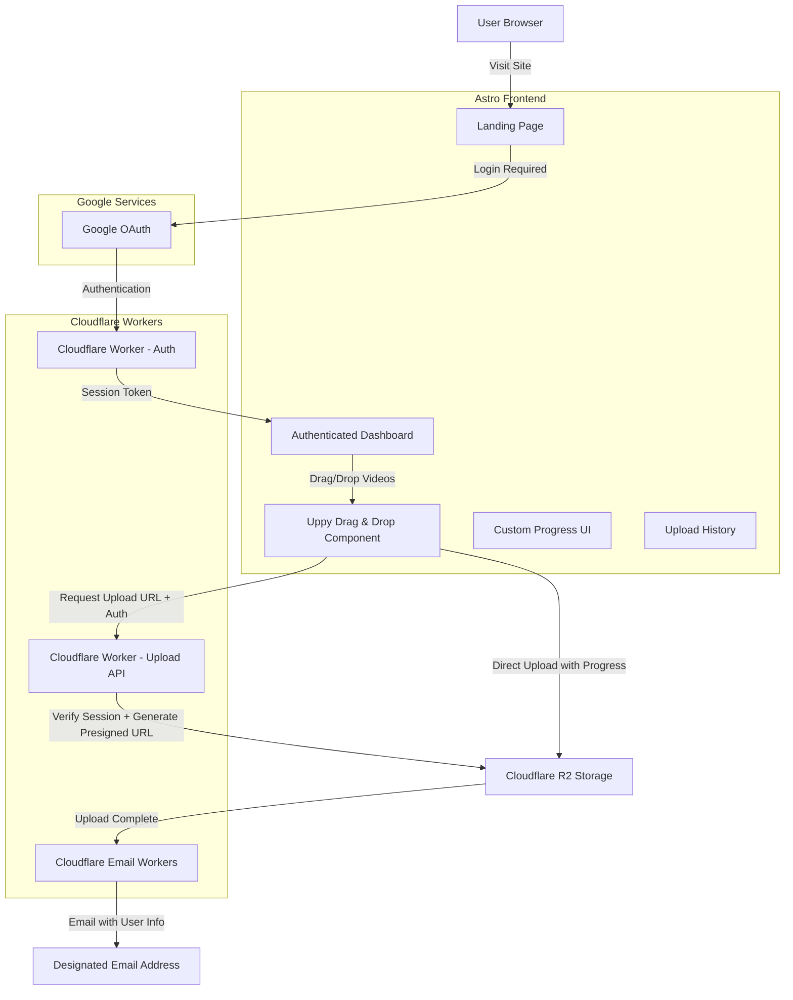

# 🎯 SKY DUMP - Video Upload Site Architecture Plan

## 📋 Project Overview
Building a modern video upload landing page with:
- **Frontend**: Astro 5.8 + React components + TailwindCSS
- **Authentication**: Google OAuth with session management
- **File Upload**: Uppy Drag & Drop with custom progress indicators (authenticated users only)
- **Storage**: Cloudflare R2 with presigned URLs via Cloudflare Workers
- **Notifications**: Cloudflare Email Workers
- **Progress**: Real-time upload progress tracking

## 🏗️ Architecture Diagram



## 🔧 Technical Implementation Plan

### Phase 1: Frontend Setup
1. **Astro Configuration**
   - Add React integration to Astro
   - Configure client-side hydration for upload component
   - Set up environment variables

2. **Dependencies Installation**
   ```bash
   npm install @astrojs/react react react-dom
   npm install @uppy/core @uppy/drag-drop @uppy/xhr-upload @uppy/progress-bar
   npm install @types/react @types/react-dom
   npm install @google-cloud/oauth2 jsonwebtoken
   npm install @types/jsonwebtoken
   ```

3. **Landing Page Structure**
   - Hero section with SKY DUMP branding
   - Google OAuth login button
   - Protected upload dashboard (authenticated users only)
   - Minimal drag & drop upload zone
   - Custom progress indicators for multiple uploads
   - Upload history/status display per user

### Phase 2: Authentication System
1. **Google OAuth Integration**
   - Google OAuth 2.0 setup with client credentials
   - Cloudflare Worker for OAuth callback handling
   - JWT token generation and validation
   - Session management with secure cookies

2. **Authentication Components** (`src/components/auth/`)
   - `LoginButton.tsx` - Google OAuth login button
   - `AuthProvider.tsx` - Authentication context provider
   - `ProtectedRoute.tsx` - Route protection wrapper
   - `UserProfile.tsx` - User info display

### Phase 3: Uppy Upload Component (Protected)
1. **VideoUploader Component** (`src/components/VideoUploader.tsx`)
   - Uppy Core with Drag & Drop plugin
   - XHR Upload plugin for direct R2 uploads
   - Video file type validation (mp4, mov, avi, mkv, webm, etc.)
   - Multiple file selection support
   - Custom drag & drop visual feedback
   - Authentication token inclusion in upload requests

2. **Custom Progress Components**
   - Individual file progress bars (custom styled)
   - Overall upload progress indicator
   - File queue management
   - Error handling and retry functionality
   - Success/failure states with animations
   - User-specific upload history

3. **Uppy Configuration**
   ```typescript
   const uppy = new Uppy({
     restrictions: {
       maxFileSize: 5 * 1024 * 1024 * 1024, // 5GB
       allowedFileTypes: ['video/*'],
       maxNumberOfFiles: 10
     }
   })
   .use(DragDrop, {
     target: '#drag-drop-area'
   })
   .use(XHRUpload, {
     endpoint: '/api/upload', // Cloudflare Worker endpoint
     getResponseData: (responseText) => JSON.parse(responseText)
   })
   ```

### Phase 4: Cloudflare Workers Setup
1. **Authentication Worker** (`workers/auth.ts`)
   - Google OAuth callback handler
   - JWT token generation and validation
   - Session management
   - User profile storage in KV

2. **Upload URL Generator Worker** (`workers/upload-api.ts`)
   - Verify user authentication before generating URLs
   - Generate R2 presigned upload URLs with user context
   - Handle CORS for frontend requests
   - Validate file types and sizes
   - Rate limiting per authenticated user
   - Return upload URLs for Uppy XHR plugin

3. **Email Notification Integration**
   - Direct integration with upload completion
   - Associate uploads with authenticated users
   - Trigger email notifications with user context
   - Log upload events with user information
   - Handle upload success/failure states
   - Update user upload history

4. **Email Notification Worker** (`workers/email-worker.ts`)
   - Cloudflare Email Workers integration
   - Template for upload completion emails
   - Include file details, metadata, and user information
   - User-specific notification preferences

### Phase 5: Cloudflare R2 Integration
1. **Configuration Setup**
   - R2 bucket configuration for video storage
   - CORS settings for direct uploads from browser
   - Lifecycle policies for file management
   - Public/private access configuration

2. **Presigned URL Generation**
   - R2 S3-compatible API integration in Cloudflare Worker
   - Secure credential management with AWS signature v4
   - Upload URL expiration handling (1 hour)
   - Presigned URL generation for large files

### Phase 6: Environment & Security
1. **Environment Variables**
   ```
   # Google OAuth
   GOOGLE_CLIENT_ID
   GOOGLE_CLIENT_SECRET
   GOOGLE_REDIRECT_URI
   JWT_SECRET

   # Cloudflare R2
   CLOUDFLARE_ACCOUNT_ID
   R2_ACCESS_KEY_ID
   R2_SECRET_ACCESS_KEY
   R2_BUCKET_NAME

   # Notifications
   NOTIFICATION_EMAIL
   CLOUDFLARE_EMAIL_API_TOKEN

   # Limits
   UPLOAD_SIZE_LIMIT=5368709120
   MAX_UPLOADS_PER_USER_PER_DAY=50
   ```

2. **Security Measures**
   - Google OAuth authentication required for uploads
   - JWT token validation on all upload requests
   - File type validation (client + server)
   - File size limits (5GB per file)
   - Rate limiting per authenticated user (50 uploads per day)
   - CORS configuration
   - Secure token handling with httpOnly cookies
   - User session management

## 📁 Project Structure
```
sky-dump/
├── src/
│   ├── components/
│   │   ├── auth/
│   │   │   ├── LoginButton.tsx
│   │   │   ├── AuthProvider.tsx
│   │   │   ├── ProtectedRoute.tsx
│   │   │   └── UserProfile.tsx
│   │   ├── upload/
│   │   │   ├── VideoUploader.tsx
│   │   │   ├── CustomProgressBar.tsx
│   │   │   ├── UploadQueue.tsx
│   │   │   └── UploadStatus.tsx
│   │   └── layout/
│   │       ├── Header.tsx
│   │       └── Footer.tsx
│   ├── pages/
│   │   ├── index.astro
│   │   ├── dashboard.astro
│   │   └── auth/
│   │       └── callback.astro
│   ├── styles/
│   │   └── uppy-custom.css
│   └── utils/
│       ├── auth-helpers.ts
│       └── upload-helpers.ts
├── workers/
│   ├── auth.ts
│   ├── upload-api.ts
│   └── email-worker.ts
├── public/
│   └── assets/
└── wrangler.toml
```

## 🎨 UI/UX Features
1. **Landing Page**
   - Clean, modern design with SKY DUMP branding
   - Google OAuth login button prominently displayed
   - Feature overview for authenticated users
   - Security and privacy information

2. **Authenticated Dashboard**
   - User profile display with Google account info
   - Upload statistics and history
   - Minimal drag & drop zone with hover effects
   - Custom progress bars with file names
   - Real-time upload speed indicators
   - Success/error notifications with retry options
   - File queue management (pause, resume, cancel)

3. **Responsive Design**
   - Mobile-friendly upload interface
   - Touch-optimized drag & drop
   - Progressive enhancement
   - Adaptive layout for different screen sizes

## 🔄 Complete User Flow
1. User visits SKY DUMP landing page
2. User clicks "Login with Google" button
3. Google OAuth authentication flow
4. User redirected to authenticated dashboard
5. User drags/selects video files into Uppy drag zone
6. Uppy validates file types and sizes locally
7. Frontend requests signed upload URLs from Cloudflare Worker (with auth token)
8. Worker validates user session and generates presigned URLs
9. Uppy XHR plugin uploads directly to R2 with progress tracking
10. Custom progress components show real-time upload status
11. Upload completion triggers email notification with user and file information
13. User upload history updated

## 📧 Email Notification Template
```
Subject: New Video Upload - SKY DUMP

A new video has been uploaded to SKY DUMP:

User Information:
- Name: {user_name}
- Email: {user_email}
- Google ID: {google_id}

File Details:
- File: {filename}
- Size: {filesize}
- Upload Time: {timestamp}
- Upload Duration: {duration}
- Storage Location: {r2_url}

Upload Details:
- File Type: {mimetype}
- Upload Speed: {avg_speed}
- Client IP: {client_ip}
- User Agent: {user_agent}

---
SKY DUMP Video Upload Service
Powered by Astro + Cloudflare + R2
```

## 🚀 Deployment Strategy
1. **Frontend**: Astro static build deployed to Cloudflare Pages
2. **Workers**: Deploy via Wrangler CLI to Cloudflare Workers
3. **Environment**: Secure secrets management in Cloudflare Dashboard
4. **Domain**: Custom domain with SSL via Cloudflare

## 🔧 Configuration Requirements

### Google OAuth Setup
1. Create Google Cloud Project
2. Enable Google+ API
3. Create OAuth 2.0 credentials
4. Configure authorized redirect URIs
5. Set up consent screen

### Cloudflare R2 Setup
1. Create bucket with appropriate access settings
2. Generate application keys with upload permissions
3. Configure CORS for direct browser uploads:
   ```json
   {
     "corsRules": [{
       "corsRuleName": "sky-dump-uploads",
       "allowedOrigins": ["https://your-domain.com"],
       "allowedHeaders": ["*"],
       "allowedOperations": ["s3_put"],
       "maxAgeSeconds": 3600
     }]
   }
   ```

### Cloudflare Setup
1. Workers KV for user session and upload history storage
2. Email Workers configuration with sender verification
3. Custom domain setup with SSL
4. Rate limiting rules per authenticated user
5. OAuth callback URL configuration

## 🎯 Uppy Advantages for This Project
- **Modular**: Only include needed plugins (Drag Drop + XHR Upload)
- **Customizable**: Full control over UI with custom progress indicators
- **Robust**: Built-in retry logic and error handling
- **Performance**: Efficient chunked uploads for large video files
- **Mobile-friendly**: Touch-optimized drag & drop experience

## 📊 Performance Considerations
- **Chunked Uploads**: For files > 100MB, implement chunked upload strategy
- **Progress Tracking**: Real-time progress with upload speed calculations
- **Error Recovery**: Automatic retry with exponential backoff
- **Memory Management**: Efficient file handling without loading entire files into memory

This architecture provides a robust, scalable video upload solution with excellent user experience, leveraging Uppy's minimal drag & drop interface with custom progress indicators, and reliable backend processing through Cloudflare Workers and R2 storage.
